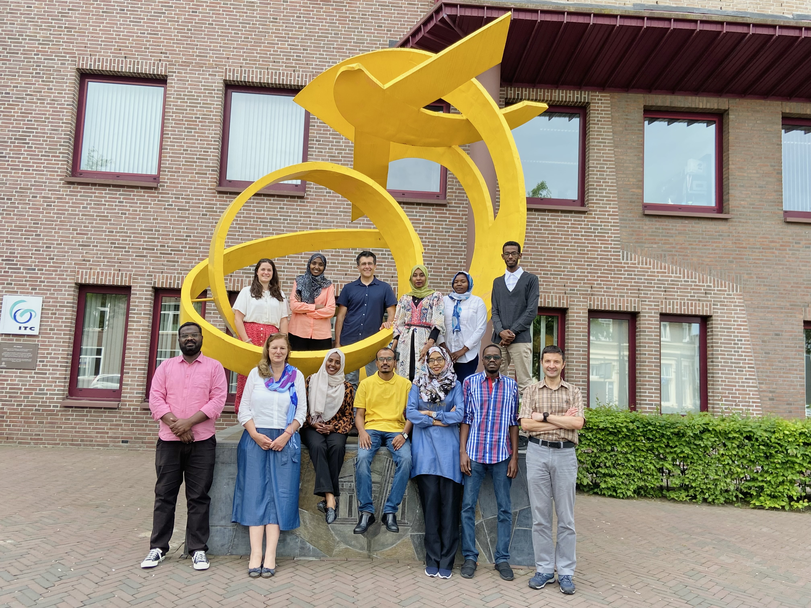

## Projects

-   :world_map: **IdeamapSudan — Urban Deprivation Mapping**

    ---

    

    Geospatial modelling of urban poverty and deprivation areas in Khartoum, combining remote sensing, socioeconomic data, and field surveys. Published at JURSE 2023.

    **Tools:** QGIS · Google Earth Engine · Python

    [:octicons-arrow-right-24: View project](ideamapsudan.md)

